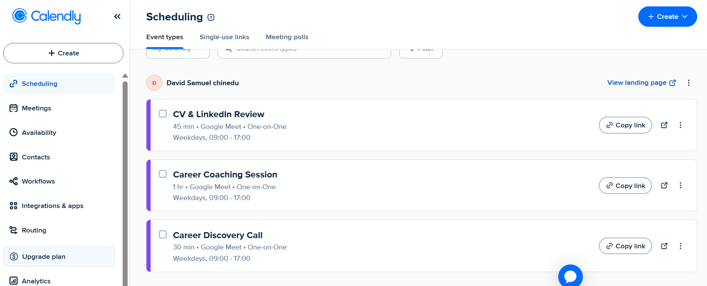
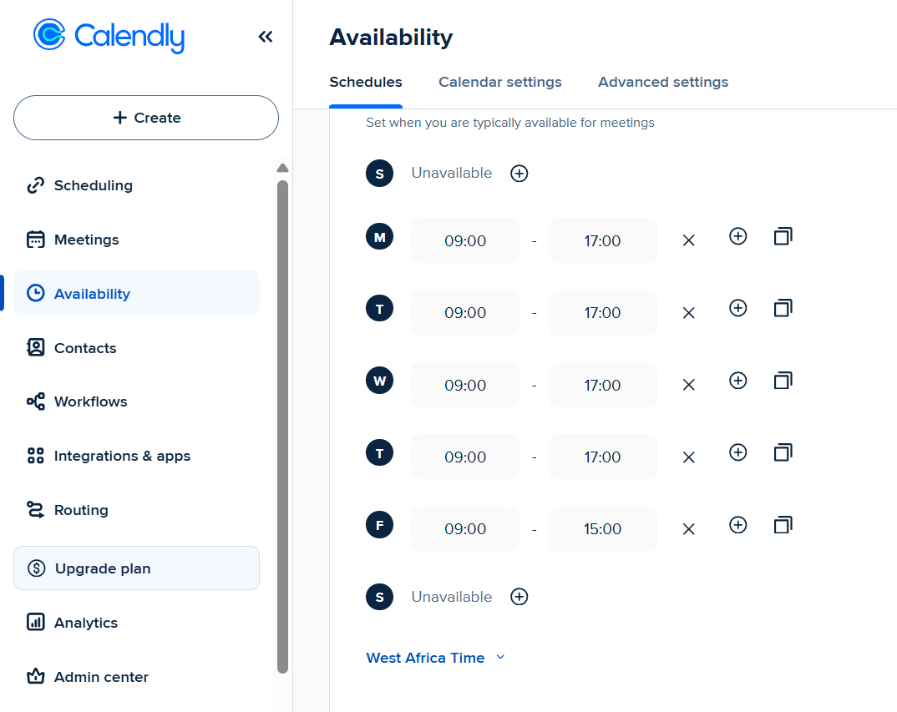
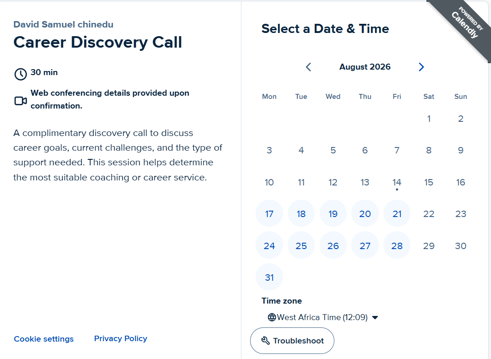
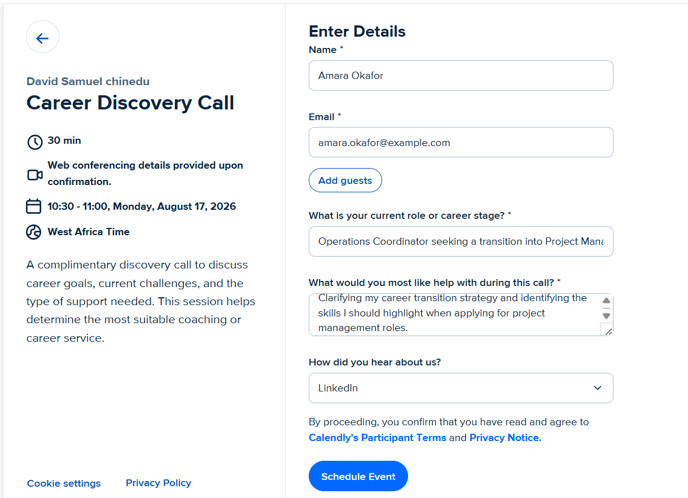
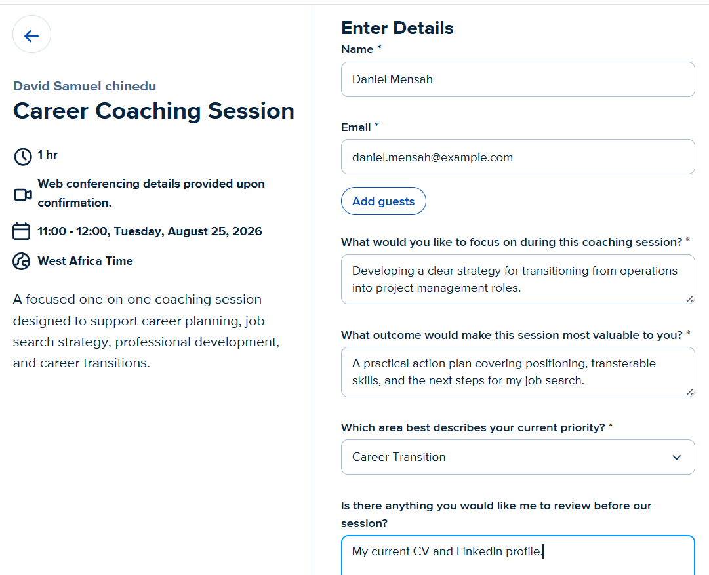
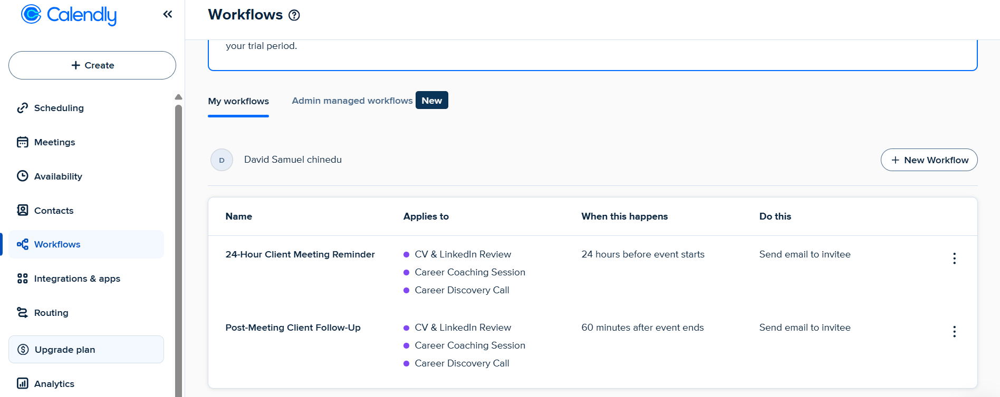
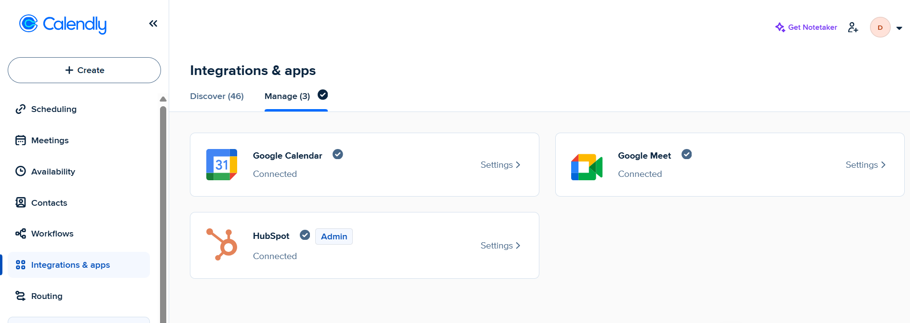
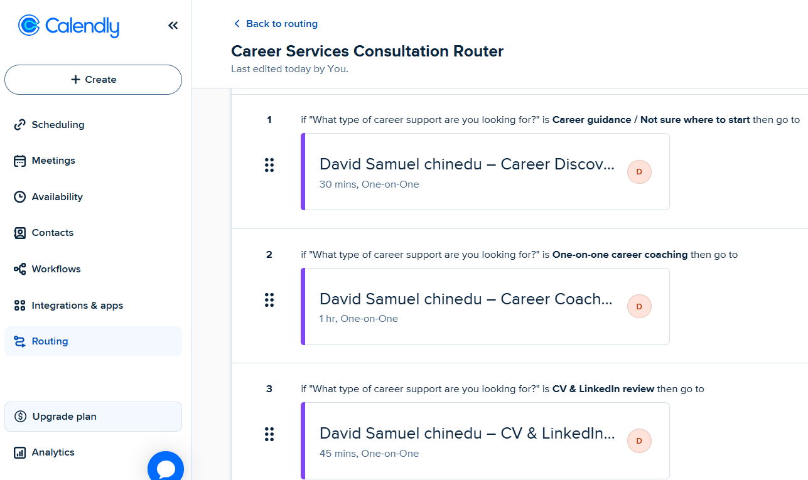

# Calendly Career Services Scheduling & Workflow Implementation

## Project Overview

This project demonstrates the implementation of a complete scheduling and client-intake system in Calendly for a fictional career services business.

The solution was designed to manage multiple career services, collect relevant client information before appointments, control business availability, automate pre- and post-meeting communication, connect supporting business applications, and route prospective clients to the most appropriate service.

Rather than creating a simple booking link, the project demonstrates how Calendly can function as part of a structured client-service workflow.

---

## Business Scenario

A career services consultant offers several types of one-on-one support and needs a scheduling system that can:

- Separate different service offerings
- Control appointment availability
- Collect service-specific information before meetings
- Automatically generate virtual meeting details
- Reduce manual follow-up
- Connect scheduling activity with other business tools
- Direct prospective clients to the appropriate service

The implementation was built around three core services:

| Service | Duration | Purpose |
|---|---:|---|
| Career Discovery Call | 30 minutes | Initial consultation for prospective clients |
| CV & LinkedIn Review | 45 minutes | Professional profile and application-material review |
| Career Coaching Session | 60 minutes | In-depth career planning and transition support |

---

# Implementation

## 1. Service Event Types

Three separate one-on-one event types were configured to support different stages of the client journey.

Each service has its own meeting duration and booking purpose while operating within a consistent scheduling structure.

<p align="center">
  
</p>

The configuration provides a clear service catalogue instead of forcing every client through the same appointment type.

---

## 2. Business Hours & Availability

A structured weekly availability schedule was created to control when clients can book meetings.

The schedule provides:

- Monday–Thursday: 09:00–17:00
- Friday: 09:00–15:00
- Saturday–Sunday: Unavailable
- West Africa Time configuration

This creates predictable booking boundaries while preserving shorter Friday availability.

<p align="center">
  
</p>

---

## 3. Client-Facing Booking Experience

The Career Discovery Call was configured as a 30-minute introductory consultation with Google Meet conferencing.

Prospective clients can view available dates and times through a clean self-service booking interface.

<p align="center">
  
</p>

The booking page clearly communicates the meeting duration, purpose, conferencing method, available dates, and time zone before the client proceeds.

---

## 4. Discovery Call Intake Form

The booking process was extended beyond basic name and email collection.

The Career Discovery Call collects information including:

- Current role or career stage
- Type of assistance required
- How the prospective client discovered the service

This allows the consultant to understand the client's situation before the meeting begins.

<p align="center">
  
</p>

---

## 5. Career Coaching Intake

The Career Coaching Session uses a more detailed intake process because it represents a deeper one-on-one engagement.

Clients are asked about:

- The focus of the coaching session
- Their desired outcome
- Their current career priority
- Materials they would like reviewed before the session

<p align="center">
  
</p>

This creates a more prepared coaching experience and reduces time spent gathering basic information during the actual appointment.

---

## 6. Automated Client Communication

Two workflows were configured across the career service event types.

### 24-Hour Client Meeting Reminder

An automated email is sent to the invitee **24 hours before the event starts**.

### Post-Meeting Client Follow-Up

An automated follow-up email is sent **60 minutes after the event ends**.

Both workflows apply across:

- CV & LinkedIn Review
- Career Coaching Session
- Career Discovery Call

<p align="center">
  
</p>

These automations help standardize client communication and reduce repetitive administrative work.

---

## 7. Business Integrations

Calendly was connected with three supporting applications:

**Google Calendar**  
Supports calendar coordination and scheduling availability.

**Google Meet**  
Provides web conferencing for scheduled appointments.

**HubSpot**  
Connects the scheduling process with CRM functionality.

<p align="center">
  
</p>

Together, these integrations demonstrate how scheduling can operate as part of a broader client-management workflow rather than as a standalone activity.

---

## 8. Career Services Routing Logic

A routing form was created to direct prospective clients to the appropriate service according to their selected career-support need.

The routing logic includes:

**Career guidance / Not sure where to start**  
→ Career Discovery Call

**One-on-one career coaching**  
→ Career Coaching Session

**CV & LinkedIn review**  
→ CV & LinkedIn Review

<p align="center">
  
</p>

This adds a qualification layer before scheduling and helps clients reach the correct service without manual intervention.

---

# Solution at a Glance

<table>
<tr>
<td width="60%" valign="top">

### Scheduling Foundation


Three service-specific event types were created with distinct meeting durations.

</td>
<td width="50%" valign="top">

### Controlled Availability


Weekly business hours define when appointments can be scheduled.

</td>
</tr>

<tr>
<td width="50%" valign="top">

### Client Intake


Pre-meeting questions capture useful information before the consultation.

</td>
<td width="50%" valign="top">

### Coaching Qualification


Detailed questions prepare the consultant for higher-touch coaching sessions.

</td>
</tr>

<tr>
<td width="60%" valign="top">

### Workflow Automation


Reminder and follow-up workflows automate routine client communication.

</td>
<td width="50%" valign="top">

### Intelligent Routing


Prospective clients are routed to the service that matches their selected need.

</td>
</tr>
</table>

---

# Workflow Architecture

```text
Prospective Client
        │
        ▼
Career Services Routing Form
        │
        ├── Career Guidance / Unsure
        │       └── Career Discovery Call
        │
        ├── One-on-One Coaching
        │       └── Career Coaching Session
        │
        └── CV & LinkedIn Support
                └── CV & LinkedIn Review
                        │
                        ▼
                 Select Date & Time
                        │
                        ▼
                  Client Intake
                        │
                        ▼
              Calendar + Google Meet
                        │
                        ▼
              24-Hour Email Reminder
                        │
                        ▼
                     Meeting
                        │
                        ▼
             Post-Meeting Follow-Up
```

---

# Key Features Implemented

- Multi-service scheduling architecture
- Three customized one-on-one event types
- Business-hour availability configuration
- Service-specific client intake forms
- Google Meet conferencing
- Google Calendar integration
- HubSpot CRM integration
- Automated 24-hour meeting reminders
- Automated post-meeting follow-ups
- Conditional service routing
- Self-service client booking
- Time-zone-aware scheduling

---

# Business Impact

This implementation demonstrates how a service business can use Calendly to create a more structured client journey.

The system reduces manual scheduling, improves pre-meeting preparation, standardizes communication, connects scheduling with CRM and conferencing tools, and directs prospective clients toward the service most relevant to their needs.

The resulting workflow moves beyond appointment booking into **client intake, qualification, automation, routing, and service delivery coordination**.

---

# Skills Demonstrated

`Calendly` `Scheduling Operations` `Workflow Automation` `Client Intake` `Process Design` `CRM Integration` `HubSpot` `Google Calendar` `Google Meet` `Routing Logic` `Client Experience` `Business Process Optimization`

---

## Project Note

This is a self-directed portfolio implementation created to demonstrate practical experience configuring Calendly for a realistic service-based business workflow. Names and client scenarios shown in the project are fictional and used solely for demonstration purposes.
